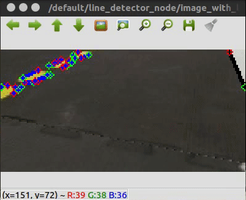

# sim-duckiebot-lanefollowing-demo

A simple demo of using the traditional Duckietown stack to do lane following in the simulator. Inside you will find the `docker-compose-lf.yml` file, which starts all of the necessary containers to launch the demo.

## Installation and Prerequisites

To get started, fork or clone this git repository and enter the project directory:

    git clone https://github.com/duckietown/sim-duckiebot-lanefollowing-demo 

## Usage

To launch the lane following demo, run the following command:
    
    docker network create gym-duckietown-net && \
    docker-compose -f docker-compose-lf.yml pull && \
    docker-compose -f docker-compose-lf.yml up

You will then start to see output from the Lane Following code, which can be found [here](https://github.com/duckietown/Software/tree/master18/catkin_ws/src/10-lane-control)

You can terminate the run at any time by pressing <kbd>CTRL</kbd>+<kbd>c</kbd>.

## Write your own agent

To write your own ROS agent, first fork this repository, and edit the file `rosagent.py`. Since we are going to be running a few containers, the best way to run is the `docker-compose` command found above.

Inside of the `docker-compose-lf.yml` file, you'll find that for purposes of this demo, we are using the `HOSTNAME=default`; the `HOSTNAME` can be thought of as the vehicle name. This is to help mitigate the discrepencies between the real robot and simulator when finding things like configuration files when using the old Duckietown stack.

## Debugging and Monitoring

With ROS, everything of interest is passed through the ROS Messaging system. There are two ways to monitor your progress:

### ROSBags

Inside of the `docker-compose-lf.yml` file, you will find a node called `rosmonitor`, which listens on a particular topic and records a bagfile to a mounted drive. This is so your container and host machine can read and write to the same disk location. Once you've recorded the bag file, you can play its contents back on your host machine with the following steps:
1. You can start a `roscore` in one terminal, and in another terminal, you will want to type in `rosbag play {PATH TO BAGFILE}`. Some nice additional command line options are `--loop` or `--rate {#}`.
2. Now, your host machine is in the same state as the Docker image when the bag was recorded. This means you can visualize the messages with things like `rqt` or `image_view`.

### Via Docker in Real Time

If you'd like to monitor the progress of your system realtime via the ROS messaging system, you can also connect to the same network from another Docker container, and monitor or record ROSBags in real time. To do this, you will need to run a command:

`docker run --entrypoint=qemu3-arm-static --network=gym-duckietown-net -it duckietown/rpi-duckiebot-base:master18 /bin/bash`

Which will give you a bash shell inside of a Duckietown-compatible Docker container (we can't use a normal ROS Kinetic container due to the fact that we need the Duckietown-specific messages to be built).

Inside of the shell, you will need to `export ROS_MASTER_URI=http://lanefollow:11311`, which will point to the ROS Master currently running in the `lanefollow` container.
